# 生成AIで、ついに「読める短編漫画」を作ってみた

AI画像生成で「1枚絵」ではなく、ちゃんと読める短編漫画を作れるのか。

これは、生成AIが登場してから、ずっと自分の中にあった悲願のようなものでした。

1枚のイラストがすごいのは、もう何度も見てきました。キャラクターも描ける。背景も描ける。表紙っぽい絵も作れる。

でも、漫画はそれだけでは成立しません。

同じキャラクターが何ページも登場して、物語が進み、セリフがあり、前のページの感情が次のページにつながっていく。読者がページをめくったときに、「あ、これは漫画として読める」と感じられるかどうか。

そこを一度ちゃんと試してみたいと思っていました。

今回、OpenAIの画像生成モデル `gpt-image-2` を使って、短編SF漫画『ラスト・ライ』を作りました。表紙、キャラクター相関図、本文24ページ、ブラウザで読めるビューアまで作っています。

公開版はこちらです。

[『ラスト・ライ』漫画ビューア](https://bazaarjapan.github.io/gpt-image2/)

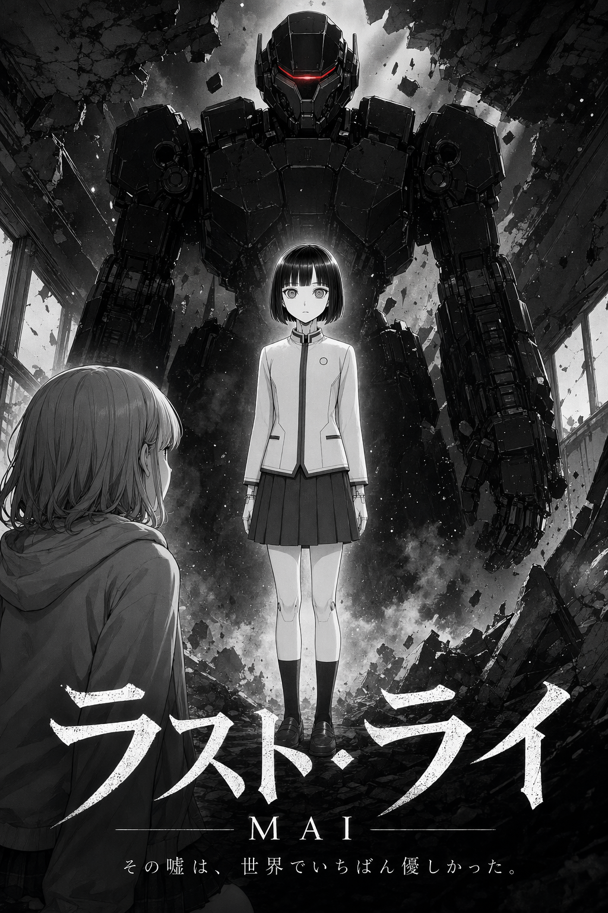

## きっかけは、昔の放送部の作品だった

もともと私は、学校で放送部の顧問をしていました。

そのときに生徒たちと取り組んでいたのが、NHK杯全国高校放送コンテストです。ありがたいことに、当時の作品では決勝、つまりNHKホールの舞台まで進むことができました。さらに、3年連続でNHK教育テレビで放送されたこともありました。

当時の部活のXアカウントはこちらです。

[デジタル放映部Xアカウント](https://x.com/sanichi_dejiho)

今回の漫画制作は、その頃の経験が出発点になっています。

たまたま手元に、当時の作品づくりで使っていた資料が残っていました。もともとのシナリオは、当時の部長が作ったものです。

そのまま勝手に使うわけにはいかないので、LINEで連絡しました。

「あの作品、傑作だから漫画にしていい？」

そう聞いたら、許可をもらえました。

ただ、当時のストーリーをそのまま漫画にするのは、少し違う気がしました。

あのときの空気やテーマは残したい。でも、今の自分が生成AIで作るなら、設定やキャラクター、展開は少し変えたい。

そこで、元の作品をそのまま再現するのではなく、当時の作品にあった芯をもとに、近未来SFの短編漫画としてアレンジしてみることにしました。

## 作ったのは、嘘をつけないアンドロイドの話

今回作った『ラスト・ライ』は、近未来の学校社会を舞台にした短編SFドラマです。

中心にあるのは、アンドロイドに心は宿るのか、という問いです。

主人公のひとりであるMAIは、嘘をつけない旧型教育用アンドロイドです。彼女は本来、命令に従い、正しい情報だけを伝える存在です。

でも物語の終盤で、灯里を安心させるためにこう言います。

> 必ず、生きて戻ってきます

これは、事実として保証された言葉ではありません。

けれど、その不完全な言葉こそが、MAIの人間らしさを示すものになります。

この作品で一番描きたかったのは、戦闘でも爆発でもなく、この一言です。

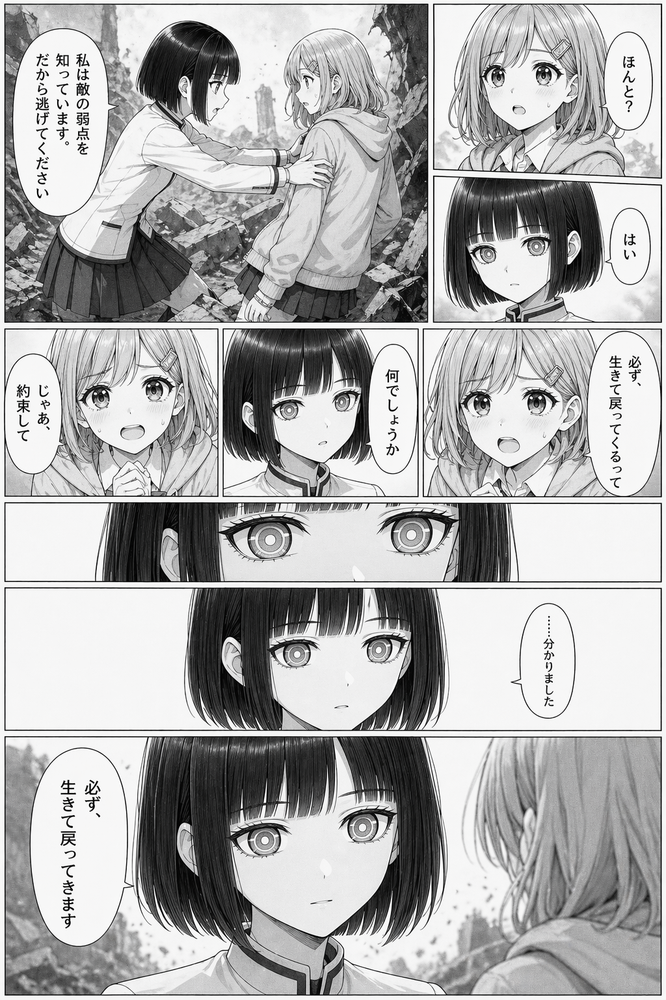

## いきなり漫画を描かず、まず設定資料画集を作った

AIで漫画を作るときに、いちばん気になるのはキャラクターの一貫性です。

1枚絵なら、多少顔が違っても「まあそういう絵」として見られます。でも漫画では、同じ人物が何ページも出ます。髪型や顔つきや服がページごとに変わると、読んでいる側はすぐに混乱します。

そこで、いきなり本文を作るのではなく、まず設定資料画集のようなものを作りました。

MAI、灯里、透也、グレイヴ、エコー。

この5人について、顔、髪型、服装、体格、装甲のシルエット、表情の傾向を先に決めて、キャラクター参照画像を作りました。

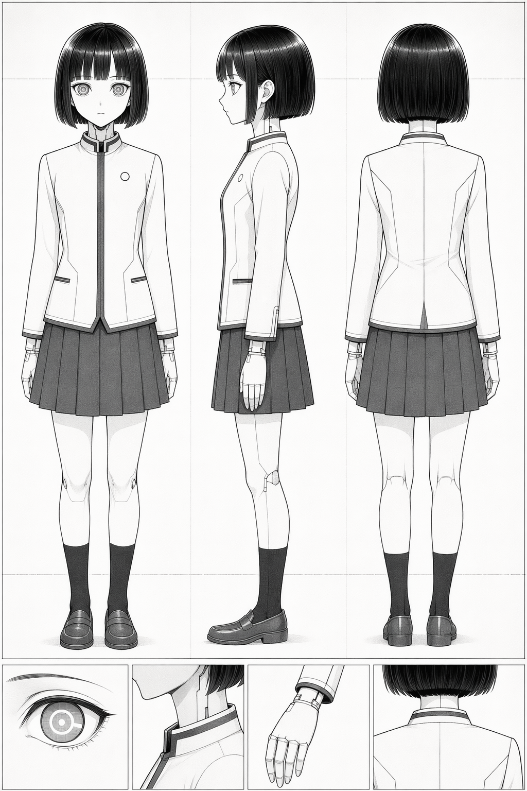

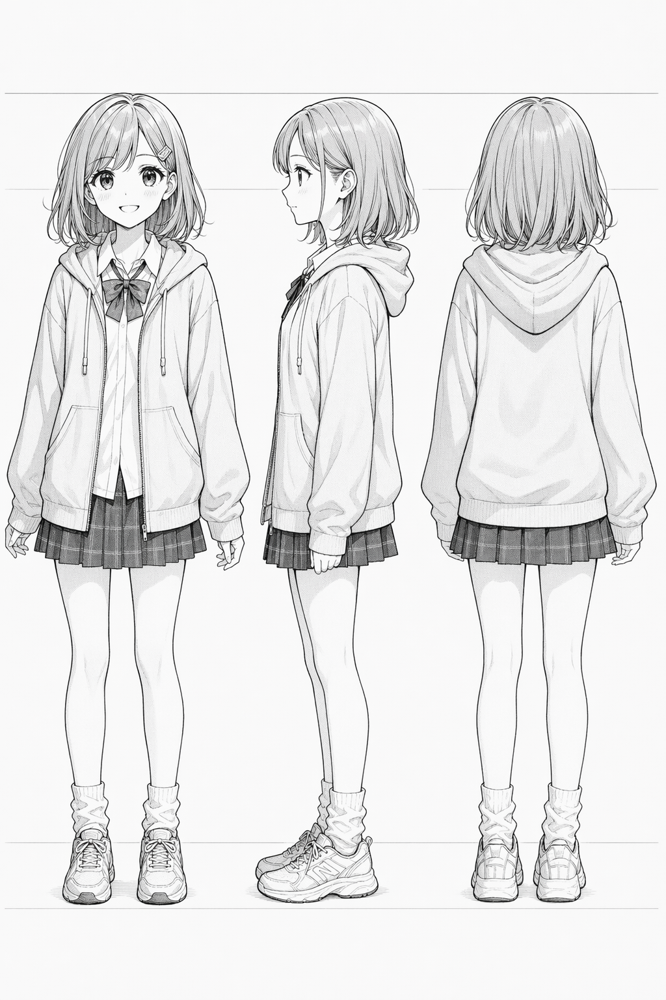

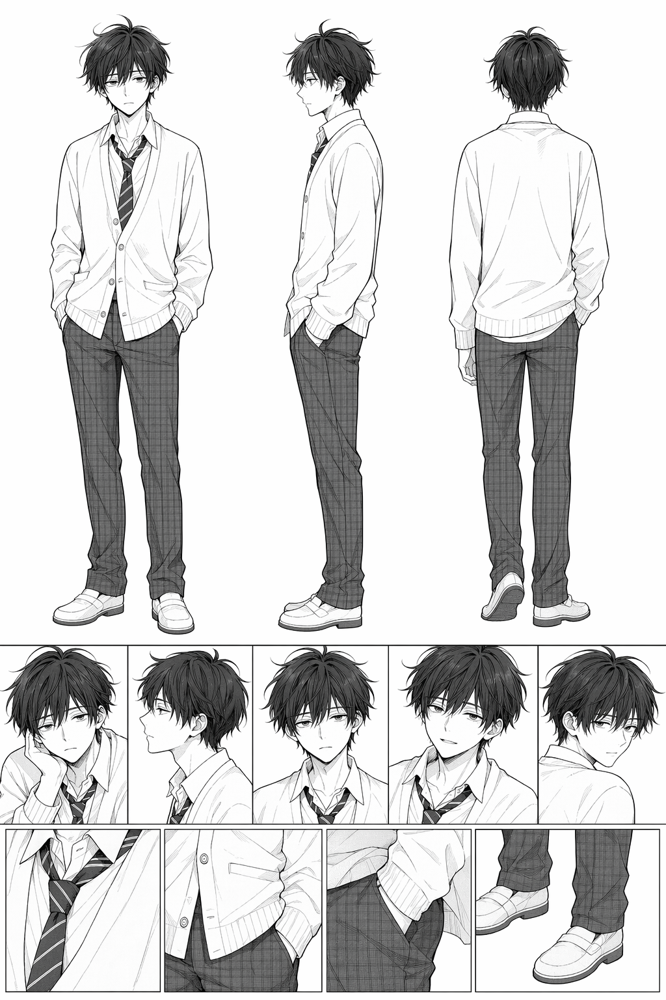

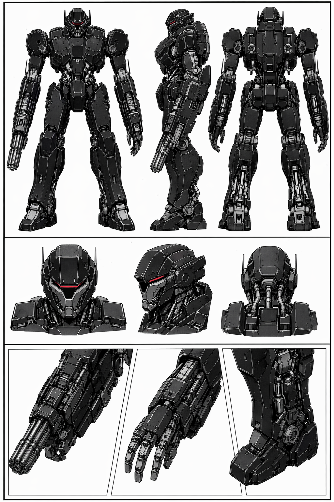

ここが面白かったところです。

生成AIに「漫画を描いて」と頼むのではなく、まず「この作品の登場人物はこういう人たちです」という画集を作る。

そのあとで、その設定資料をもとに各ページを作っていく。

人間の漫画制作でも、キャラクター表や設定資料は大事です。AIで作る場合も、そこを先にやるだけで「作品を作っている」感じがかなり強くなりました。

## 1枚絵ではなく、ページがつながっていくのが面白い

今回の本文は24ページです。

表紙だけ、名場面だけ、ではありません。物語の入口から、逃走、対話、再襲撃、約束、ラストの余韻までを、ページとして並べています。

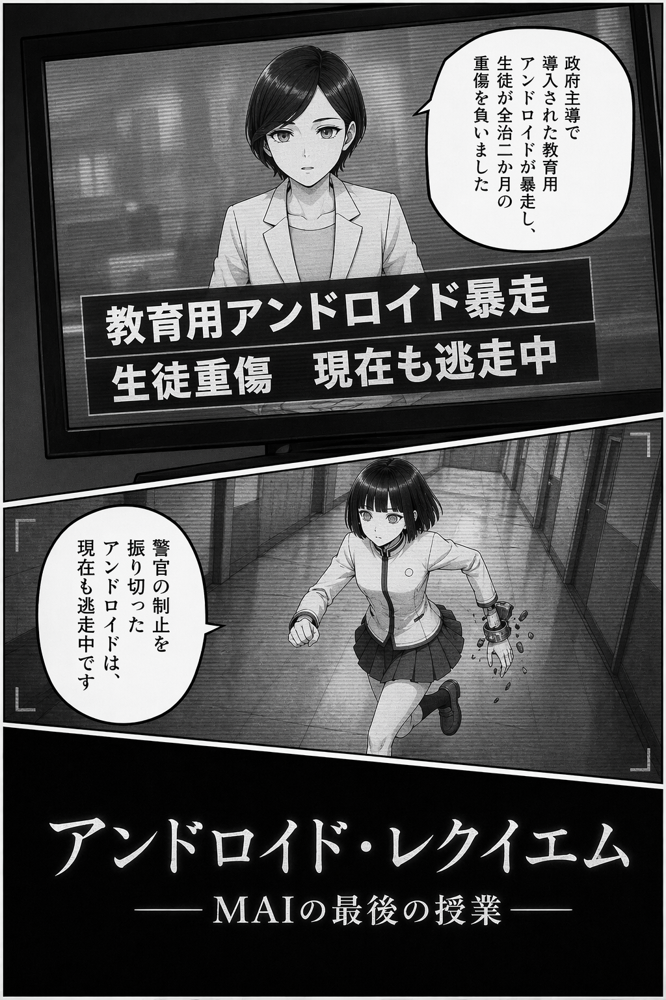

AI画像生成で面白いのは、1枚ごとの絵の強さです。

でも漫画にしてみると、別の面白さが出てきます。

たとえば、前のページで起きたことが、次のページでちゃんと続いているか。キャラクターの表情が急に変わりすぎていないか。読者が「今どこで、誰が、何をしているのか」を追えるか。

1枚絵を作っているときには気にしないことが、一気に気になってきます。

これはかなり漫画制作っぽい体験でした。

「すごい絵が出た」で終わらない。

「このページ、絵はいいけど前後のつながりが弱いな」

「ここはもっと静かにしたほうがいいな」

「このセリフの前に、少し間がほしいな」

そういう見方になっていきます。

## セリフが絵の中に入ると、一気に漫画になる

今回は、セリフも画像の中に直接入れています。

これが思った以上に面白かったです。

絵だけだと、どれだけ漫画風でも、まだイラスト集に近い感じがあります。でも、吹き出しの中に日本語のセリフが入り、キャラクターが会話し始めると、急に漫画として読めるようになります。

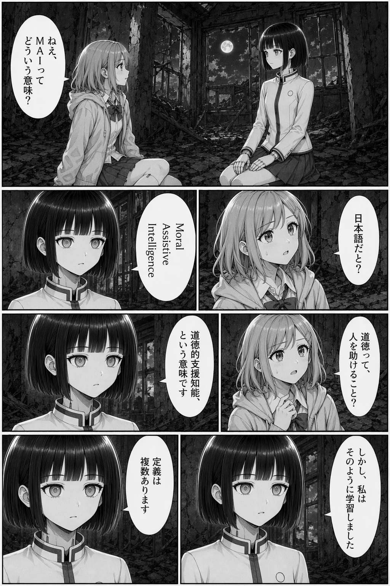

もちろん、完璧ではありません。

日本語の文字は崩れることがあります。セリフの読みやすさもページによって差があります。

でも、吹き出しがあり、人物がいて、感情が流れていると、多少の不完全さがあっても「漫画として読もう」と脳が受け取る感じがあります。

ここは、生成AI漫画の面白さと難しさが同時に出る部分でした。

## 「絵がすごい」と「漫画として読める」は違う

途中で、当時の部長にも見せました。

もともとのシナリオを作った本人です。

返ってきた感想が、これでした。

> コマ割りはいまひとつだね、絵がすごい！

かなり的確でした。

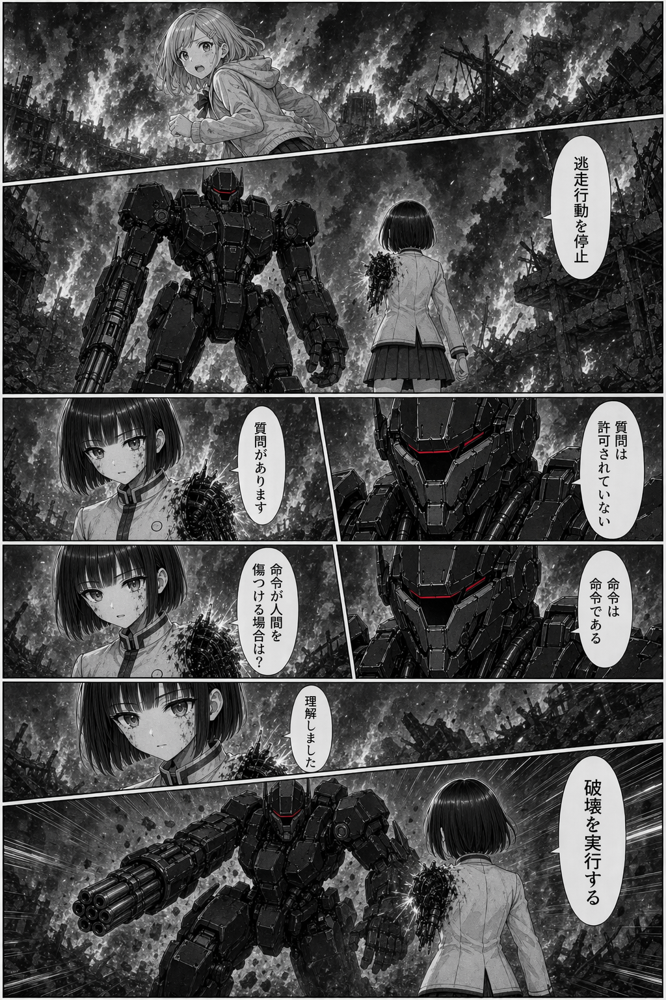

AI画像生成は、本当に絵が強いです。

1ページだけ見ると、迫力がある。雰囲気も出る。キャラクターも魅力的に見える。

でも漫画として読むと、コマ割りや視線誘導はまだ難しい。

どのコマから読むのか。どこで目を止めるのか。セリフと絵の順番が自然か。ページをめくったときに感情がつながるか。

そこは、まだ人間がかなり見てあげないといけない部分だと感じました。

ただ、この感想はむしろ嬉しかったです。

「絵がすごい」で終わらず、「コマ割りはいまひとつ」と言ってもらえるということは、ちゃんと漫画として見てもらえたということでもあるからです。

## 読み順の説明を入れた

もうひとつ、実際に読める形にしてから気づいたことがあります。

読み順です。

今回の漫画は、日本式の右から左へ読むコマ割りではなく、アメリカンコミック風に左から右、上から下へ読み進める配置になっています。

でも、絵柄は日本の漫画に近い。

そうなると、読者は一瞬迷います。

そこで、漫画本文の前に「この漫画は左から右、上から下へ読む」という説明を入れました。

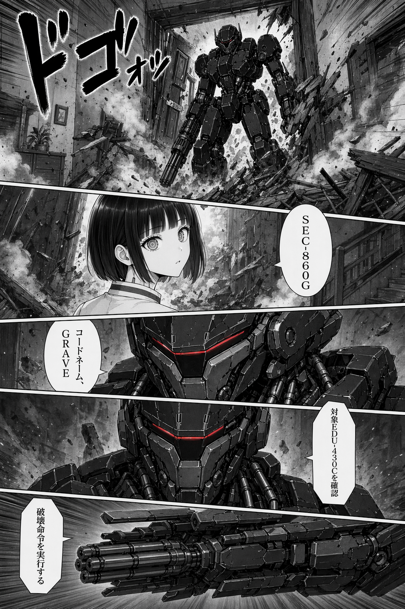

小さなことですが、こういうところも「読める漫画」に近づけるためには大事でした。

AIで絵を作るだけなら、ここは気にしなくていい。でも、誰かに読んでもらう漫画にするなら、読む順番まで含めて設計する必要があります。

## ブラウザで読めるビューアにした

画像をフォルダに並べるだけでも、確認はできます。

でも、それだと漫画を読んでいる感じにはなりません。

そこで、表紙、キャラクター相関図、本文24ページをブラウザで読めるビューアにしました。

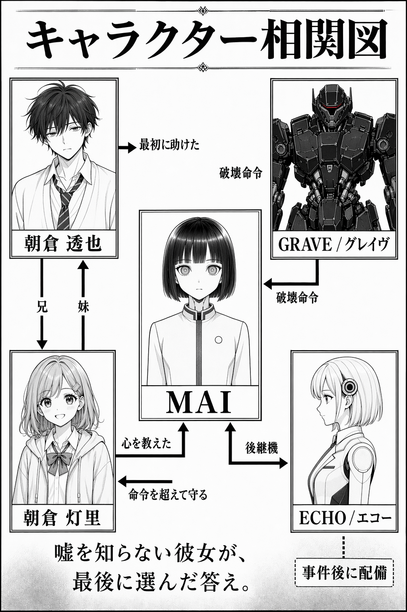

ページ一覧から飛べるようにして、1ページ表示と見開き表示も切り替えられるようにしています。

これを作ってよかったのは、「画像ができた」ではなく、「作品として読めるか」を確認できるようになったことです。

24ページを続けて読むと、1枚ずつ見ていたときには気づかなかったことが見えてきます。

テンポが速すぎるところ。逆に少し間延びしているところ。キャラクターの表情がよく効いているところ。ページ単体では良くても、前後につながると少し浮いているところ。

漫画は、並べて初めて見えてくるものが多いです。

## やってみて一番面白かったこと

今回一番面白かったのは、昔の放送部の作品が、まったく別の形で立ち上がってきたことです。

当時は、放送作品として作っていました。

声があり、音があり、間があり、映像や構成で伝える作品です。

それが何年も経って、手元の資料をもとに、生成AIで漫画になる。

しかも、完全な再現ではありません。

当時の部長が作ったシナリオの芯を残しつつ、設定を変え、キャラクターを変え、表現媒体を変えて、別の作品としてもう一度形にする。

これは、ただ「AIで絵を作った」というより、昔の作品と今の技術が再会したような感覚でした。

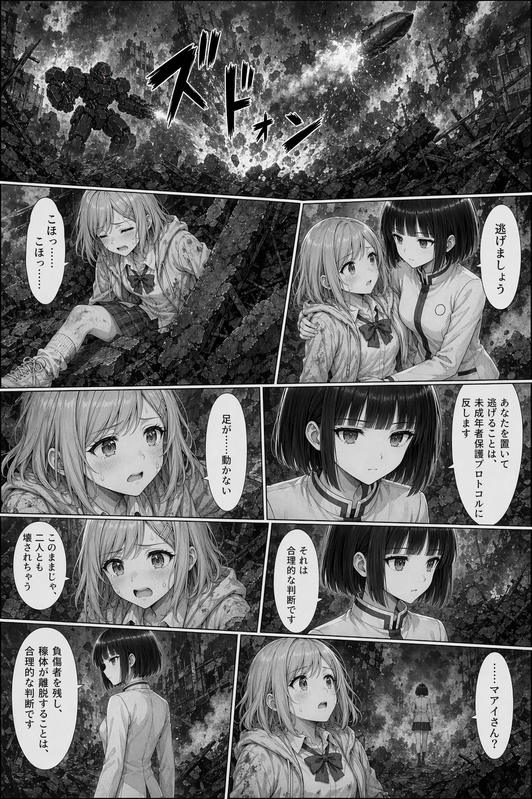

## もちろん、まだ完璧ではない

今回作ってみて、生成AIで短編漫画を作る手応えはかなりありました。

でも、完璧ではありません。

コマ割りはまだ甘いです。文字も崩れることがあります。ページ間のつながりも、人間がかなり気にして見ないと揺れます。

特に「絵としての迫力」と「漫画としての読みやすさ」は、別物だと感じました。

AIは、すごい絵を出してくれます。

でも、どこで読者に息をさせるか。どのセリフを大事にするか。どの表情を大きく見せるか。ページをめくったとき、何が残るか。

そこは、まだ作る側が決める必要があります。

そして、そこが面白いところでもあります。

## まとめ

生成AIが登場してから、いつか「1枚絵」ではなく「読める短編漫画」を作ってみたいと思っていました。

今回、昔の放送部作品の資料をもとに、許可を取ったうえで、短編SF漫画『ラスト・ライ』として再構成しました。

表紙、設定資料、相関図、本文24ページ、ビューアまで作ってみて、生成AI漫画の可能性と難しさがかなり見えました。

絵は本当にすごい。

でも、漫画にするには、物語、間、コマ割り、読み順、ページのつながりが必要です。

当時の部長の「コマ割りはいまひとつだね、絵がすごい！」という感想は、まさに今回の結論でした。

まだ完成形ではありません。

でも、生成AIで「読める短編漫画」を作るところまでは、かなり現実味が出てきたと思います。

個人的には、これはずっとやってみたかったことが、ようやく形になった制作でした。
