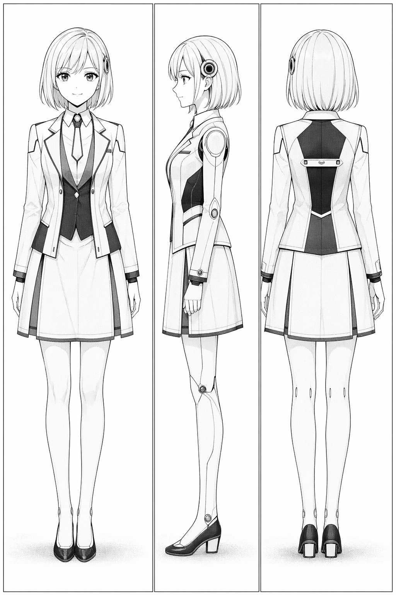

# ECHO / エコー 三面図プロンプト

## 参照画像

画像ファイル: `../../images/reference/echo.png`

## Image Prompt

Japanese all-ages manga character design sheet, front view, side view, back view, full body, same character consistency. New educational android model EDU-860G, called ECHO, very close to human, natural smile, modern school assistant outfit, clean future-friendly design. It must feel pleasant but slightly ambiguous. Black-and-white manga line art with light screentone. No speech bubbles, no text, no logo, no watermark.

Shared style:
# 作画共通仕様

- 形式: Japanese black-and-white manga page, right-to-left reading flow, clean ink line art, cinematic paneling.
- 画面: 縦長ページ、完成原稿向け。セリフは吹き出し内にだけ画像として直接描き込む。
- 線: 少年漫画寄りの読みやすい線、人物の表情を明確に、背景は必要箇所だけ密度を上げる。
- トーン: 序盤は軽いコメディ、中盤は静かな会話劇、後半は緊張、ラストは余韻。
- 近未来感: 現代の住宅、学校、病院に控えめなSFデバイスが混ざる程度。過度に宇宙的・サイバーパンクにしない。
- 重要演出: 爆発よりも、マアイの微細な表情変化を優先する。
- コマ割り: 均等グリッド禁止。大ゴマ、斜め割り、縦長コマ、細い間のコマ、白い余韻、破断コマ、速度線、黒ベタをページごとに大胆に使い分ける。
- 参照画像: `images/reference`の設定資料画像集をキャラクターの唯一の正解として扱う。髪型、顔、瞳、服、体格、装甲シルエットを変えない。
- 文字: 吹き出しには「」の中の本文だけを読みやすく入れる。話者名、ラベル、余計な文字、意味不明な文字、ローマ字化、誤字を入れない。
- 禁止: photorealistic, 3D render, western superhero style, excessive gore, messy unreadable panels, random unrelated text, watermark, signature.
